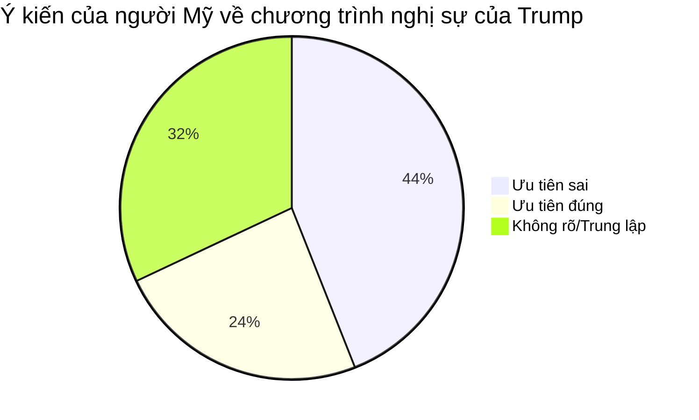
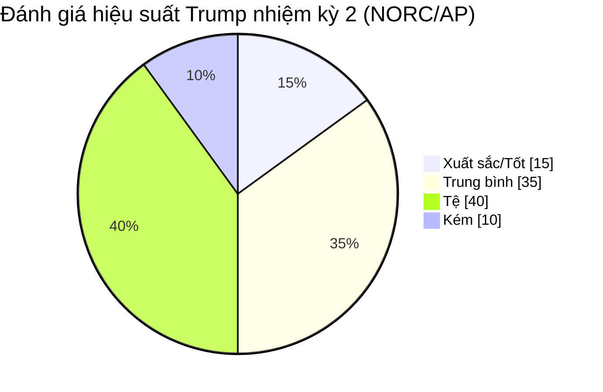
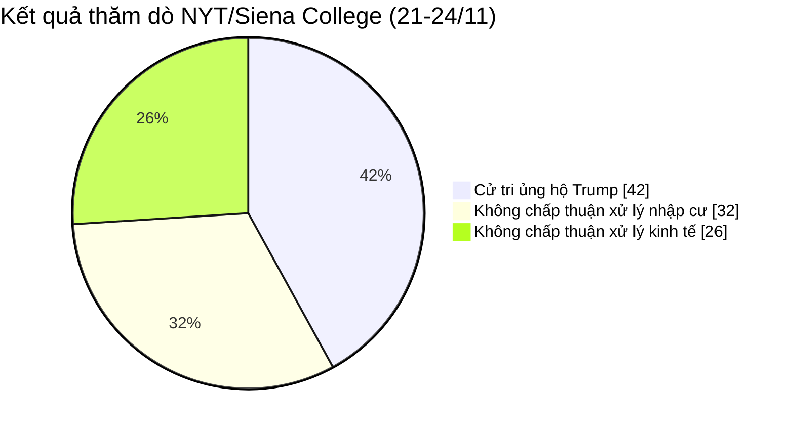
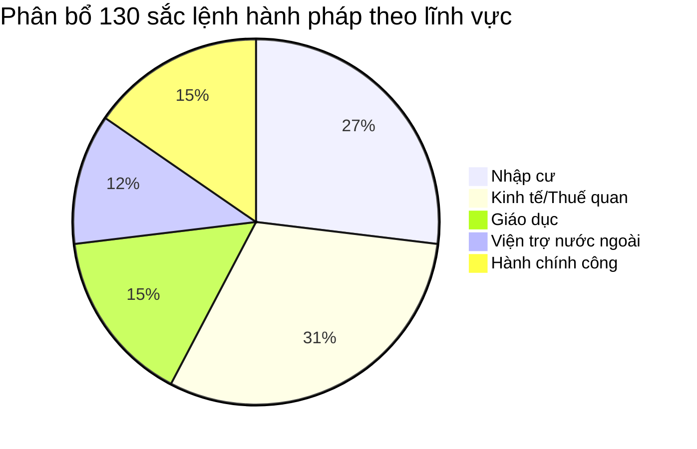
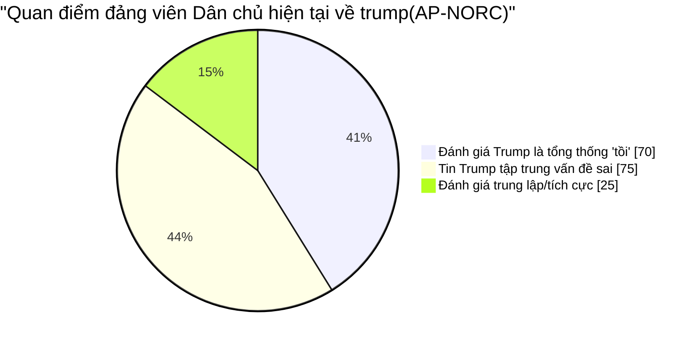
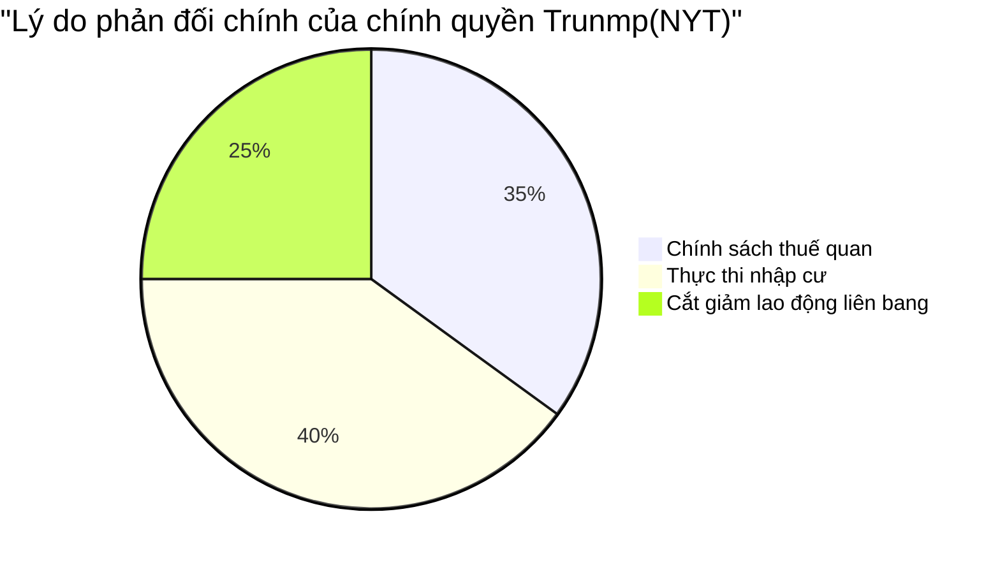
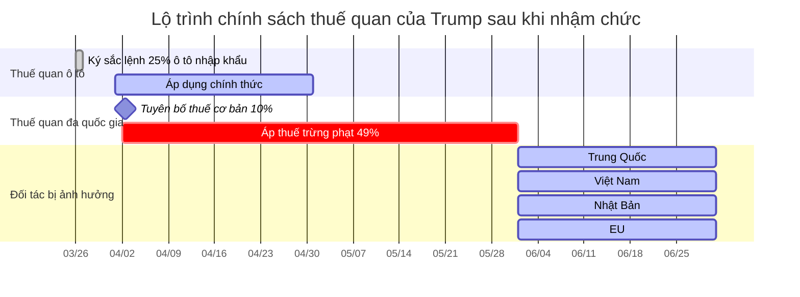

# Điểm tin ngày 28 tháng 4 2025

CHƯƠNG TRÌNH TIN TỨC QUỐC TẾ – VH3M SHOW - ĐA CHIỀU

Cập nhật những diễn biến nóng nhất từ khắp nơi trên thế giới.

Kính chào quý vị và các bạn! Đây là chương trình Tin tức Quốc tế do VH3M Show tổng hợp và chia sẻ. Những sự kiện đáng chú ý nhất xoay quanh căng thẳng Nga-Ukraine, cuộc chiến thương mại Mỹ - Trung, cùng những phân tích sâu sắc sẽ được chúng tôi gửi tới quý vị trong hôm nay. Đừng quên Like, Share và Đăng ký kênh để không bỏ lỡ thông tin!  

## Theo Cuộc thăm dò của truyền thông Mỹ: Hầu hết người Mỹ không hài lòng với Trump, Riêng đảng Cộng hòa chỉ còn một nửa số người ủng hộ.

Cột mốc 100 ngày nhậm chức của Tổng thống Hoa Kỳ Trump. Vào thời điểm này, một cuộc thăm dò do hãng thông tấn Associated Press công bố vào ngày 26 tháng 4 theo giờ Mỹ cho thấy ngày càng nhiều người Mỹ không hài lòng với chương trình nghị sự chính trị của Trump. Ngay cả những người thuộc đảng Cộng hòa, chỉ còn khoảng một nửa đồng ý với chương trình nghị sự của ông này, và ngày càng có nhiều sự phản đối đối với các chính sách thuế quan, hành động thực thi luật nhập cư và cắt giảm lao động liên bang.

Trung tâm nghiên cứu các vấn đề công cộng của Associated Press-NORC đã khảo sát 1.260 người lớn từ ngày 17 đến ngày 21 tháng 4. Kết quả cho thấy 44% người Mỹ tin rằng chương trình nghị sự của Trump có những ưu tiên sai, so với chỉ 24% tin rằng chương trình nghị sự của ông có những ưu tiên đúng đắn. 44% người Mỹ tin rằng chương trình nghị sự của Trump không đúng trọng tâm. 

Cuộc khảo sát của Trung tâm nghiên cứu các vấn đề công cộng NORC-Associated Press cho thấy khoảng 40% người Mỹ cho rằng hiệu suất làm việc của Trump trong nhiệm kỳ thứ hai là "tệ" và khoảng 1/10 người Mỹ cho rằng ông đang làm việc "kém".

Cuộc thăm dò chung của New York Times/Siena College đối với 913 cử tri từ ngày 21 đến ngày 24 cho thấy tỷ lệ ủng hộ Trump đã giảm xuống còn 42% và cử tri không chấp thuận cách ông xử lý các vấn đề bao gồm nhập cư và kinh tế.

Tờ New York Times phơi bày những con số không tốt về tình hình của Trump, có thể thấy Trump đã có một khởi đầu tệ hại. Đối với hầu hết các tổng thống, 100 ngày đầu tiên tại nhiệm phải đều có chỉ số ủng hộ tích cực, và Trump hoàn toàn ngược lại khi không tận dụng được khoảng thời gian đầu quý báu này, ông này để mất lòng tin rất nhanh dẫn đến chỉ số âm, dự báo tương lai sẽ còn khó khăn hơn nữa kể từ thời điểm này trở đi.

Theo số liệu thống kê của giới truyền thông, từ tháng 1 đến tháng 4 khi nhậm chức, Trump đã ký 130 sắc lệnh hành pháp liên quan đến nhiều vấn đề như kinh tế, giáo dục, viện trợ nước ngoài, nhập cư, v.v., đảo ngược nhiều nền tảng chính sách của Hoa Kỳ. Vào ngày nhậm chức, ông đã ký lệnh hành pháp đình chỉ tài trợ cho Cơ quan Phát triển Quốc tế Hoa Kỳ (USAID). Kể từ tháng 3, ông đã nhiều lần tuyên bố áp đặt thuế quan cao đối với nhiều quốc gia, thúc đẩy đóng cửa Bộ Giáo dục Hoa Kỳ và ra lệnh cho Bộ Hiệu quả Chính phủ (DOGE) dẫn đầu chính phủ liên bang trong việc cắt giảm các kế hoạch...

Theo một cuộc khảo sát của Trung tâm nghiên cứu các vấn đề công cộng AP-NORC, ba phần tư số người theo đảng Dân chủ tin rằng Trump tập trung vào những vấn đề sai trái, và khoảng 70% số người theo đảng Dân chủ tin rằng ông là một tổng thống "tồi" cho đến nay. Hãng thông tấn Associated Press lưu ý rằng tỷ lệ có đánh giá xấu về Trump tăng so với tháng 1, khi khoảng 60% đảng viên Dân chủ cho rằng ông sẽ làm "tệ".

Dân biểu đảng Dân chủ California Rahsaan Henderson mô tả gần 100 ngày tại nhiệm của Trump là "một trong 100 ngày dài nhất mà tôi từng trải qua", nói rằng "Tôi nghĩ bốn năm tới sẽ là thử thách để xem ai có thể chống lại được vị tổng thống khinh thường và thách thức nhất này".

Cuộc thăm dò của Associated Press cho thấy những người Cộng hòa được Associated Press khảo sát đặc biệt thích nỗ lực do tỷ phú Musk và kế hoạch cắt giảm chi phí DOGE của Trump. Matthew Spencer, một đảng viên Cộng hòa đến từ Texas, tin rằng DOGE đã đạt được tiến bộ lớn trong việc cắt giảm chi tiêu, "Tôi cũng đồng ý với khái niệm 'Nước Mỹ trên hết'" và "Tôi đồng ý với các chính sách mà ông ấy đã thực hiện về bảo vệ biên giới và lập trường của Hoa Kỳ về thuế quan."

Tuy nhiên, hãng thông tấn Associated Press đã tìm thấy những dấu hiệu mới cho thấy một số người ủng hộ Trump có thể đang ngày càng không hài lòng với màn trình diễn của ông này cho đến nay. Tỷ lệ người Cộng hòa cho rằng Trump là một tổng thống "tốt" đã giảm khoảng 10 phần trăm kể từ tháng 1. Có khả năng họ nghĩ Trump “kém” hoặc “tệ hại” trong tương lai.

Stephanie Melnyk, một cử tri Đảng Cộng hòa ở Tennessee, ủng hộ chính quyền Trump, nhưng bà không chấp thuận chính sách đối ngoại của ông, đặc biệt là về vấn đề Ukraine. Melnik, một người nhập cư Ukraine, tin rằng những gì Trump chỉ là "biện pháp tạm thời không lâu dài".

Melnick nói: "Ông ta rất kiêu ngạo, như thể đang yêu cầu tôi làm theo ý ông ta vậy".”

Douglas Williams, một chủ trang trại và chủ ngân hàng ở Missouri đã bỏ phiếu cho Trump trong ba cuộc bầu cử vừa qua, nói với tờ The New York Times rằng ông lo ngại rằng một số sắc lệnh hành pháp của tổng thống đang "đi quá giới hạn".

Chỉ có một số rất ít người được hỏi đồng ý với chính sách của Trump. Đồ họa của Associated Press

Tờ New York Times cho biết các cử tri cho rằng Trump đã "đi quá xa" trong nhiều vấn đề - chính sách thuế quan, hành động thực thi luật nhập cư và kế hoạch cắt giảm lực lượng lao động liên bang. Cuộc khảo sát của tờ báo cho thấy 54% người dân tin rằng hành động của Trump "vượt quá quyền hạn của ông", bao gồm 16% đảng viên Cộng hòa và 62% cử tri độc lập.

Trump cũng đang mất đi sự ủng hộ của cử tri về các vấn đề kinh tế từng giúp ông giành chiến thắng trong cuộc bầu cử tổng thống. Một cuộc thăm dò của New York Times/Siena College cho thấy 55% cử tri không chấp thuận các chính sách kinh tế của Trump, và một cuộc khảo sát của Trung tâm nghiên cứu các vấn đề công cộng Associated Press-NORC cho thấy chỉ hơn một phần ba số người được hỏi chấp thuận cách Trump xử lý các vấn đề kinh tế.

Ngay sau khi nhậm chức, Trump đã bắt đầu thực hiện chính sách thuế quan của mình. Ngày 26 tháng 3, ông đã ký một sắc lệnh hành pháp, công bố mức thuế 25% đối với ô tô và phụ tùng nhập khẩu; Vào ngày 2 tháng 4, ông tiếp tục mở rộng phạm vi của cuộc chiến thuế quan dưới danh nghĩa "thuế quan có đi có lại", tuyên bố áp dụng mức thuế cơ bản 10% đối với tất cả các đối tác thương mại và áp dụng mức thuế trừng phạt lên tới 49% đối với 60 đối tác thương mại bao gồm Trung Quốc, Việt Nam, Nhật Bản và Liên minh châu Âu.

Newsweek phơi bày vào ngày 26 rằng trong suốt chiến dịch tranh cử và hai nhiệm kỳ tổng thống, Trump đã định vị mình là người tạo ra thỏa thuận và quản lý kinh tế, tuyên bố rằng ông có thể "mang lại việc làm", giảm chi phí và "làm cho nước Mỹ vĩ đại trở lại". Tuy nhiên, khi lạm phát gia tăng và chiến tranh thương mại với các quốc gia như Trung Quốc và Canada leo thang, cử tri dường như ngày càng mất lòng tin vào các chính sách kinh tế của Trump và ngày càng có nhiều người lo ngại rằng nền kinh tế Hoa Kỳ đang suy thoái.

Nhiều nhà kinh tế, công ty tài chính, đảng viên Dân chủ và một số đảng viên Cộng hòa , bao gồm cả người đoạt giải Nobel Paul Krugman, đã cảnh báo rằng chính sách thuế quan của Trump sẽ gây ra suy thoái kinh tế. Chính quyền Trump không loại trừ khả năng này, lưu ý rằng sẽ có một số gián đoạn thị trường trong quá trình chuyển đổi, nhưng chỉ đơn giản kêu gọi người Mỹ "kiên trì" trong suốt "cuộc cách mạng kinh tế".

Hãng thông tấn Associated Press lưu ý rằng hầu hết những người đột nhiên thay đổi quan điểm trong vài tháng đầu nhiệm kỳ của Trump đều là đảng viên Dân chủ và độc lập. Gabriel Antonucci, một đảng viên Dân chủ 26 tuổi, tin rằng nhiệm kỳ thứ hai của Trump sẽ "vô lý hơn nhiều so với những gì ông mong đợi".

Antonucci phàn nàn rằng "có vẻ như ông ấy thực sự đang làm mọi cách có thể để đưa ra những quyết định sai lầm, và tình hình trong bốn năm nữa có thể còn tệ hơn bây giờ".

## Một số Ý kiến bình luận của độc giả.

Chẳng có gì ngạc nhiên khi ông ta chọn Vance, một người ngốc nghếch và cực đoan hơn ông ta, làm phó tổng thống. Đây là điều đau đầu đối với những người muốn luận tội hoặc ám sát ông.

Chúng ta phải đợi vài tháng nữa để thấy được sự kỳ diệu của chính quyền Trump. Chính phủ Trung Quốc cần phải kiên nhẫn chờ đợi, và sự kiên nhẫn sẽ mang lại điều kỳ diệu. Tin tốt sẽ liên tiếp đến một cách bất ngờ từ bên kia đại dương.

Tôi nhớ khi Harris ra tranh cử tổng thống và Trump chọn Vance làm ứng cử viên phó tổng thống, đây là ý kiến của công chúng trên Internet. Giống như bây giờ, Trump chắc chắn sẽ không được bầu, Vance là một kẻ ngốc, Harris sẽ thắng, v.v.

Hiện nay, phần lớn sự bất mãn trong nước Mỹ là do những khác biệt về ý thức hệ. Khi hậu quả của cuộc chiến thương mại bắt đầu lộ rõ và giá cả bắt đầu tăng vọt, lợi ích kinh tế của một bộ phận lớn cử tri sẽ bắt đầu chịu thiệt hại đáng kể. Chỉ đến lúc đó, sự bất mãn trong nước Mỹ mới có thể được thể hiện đầy đủ. Bây giờ chỉ còn mưa phùn thôi.
Thời điểm này chưa đến, đừng lo lắng, hãy chờ xem! Chương trình sắp bắt đầu, hãy chuẩn bị trà, cắt dưa và xem chương trình nhé!

Cảm ơn quý vị và các bạn đã xem bản tin ngày hôm nay. Một lần nữa xin cảm ơn và hẹn gặp lại ở những bản tin khác. Hãy đăng ký kênh để ủng hộ VH3M Show.

